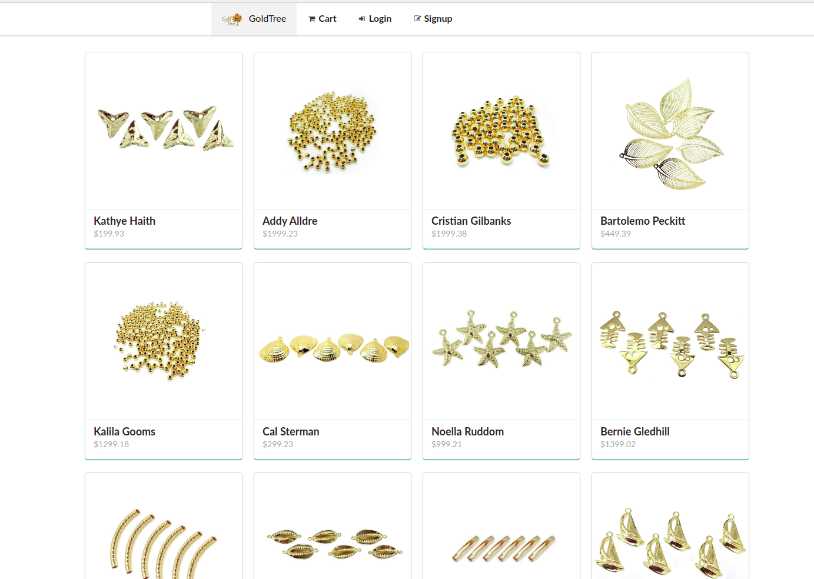

## MERN Stack with Next.js

## Description
This is a Full-Stack App with MongoDB, Express, React and Node.js

## Using this project

* Create a next.config.js for environment variables in your server.
   * MONGO_SRV: "Direction-mongo-atlas-DB",
   * JWT_SECRET: "ToKEN",
   * CLOUDINARY_URL: "ADD-your-url-to-upload-pictures",
   * STRIPE_SECRET_KEY: "Stripe-secret-key"
  
## Setup

* `git clone` this repo
* `cd` into it.
* `yarn`

## To make it run

* `yarn run dev` 
